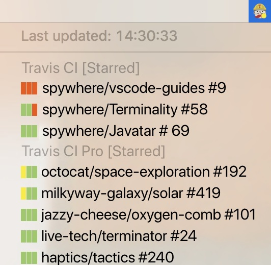

## Travis Status

A status bar app that let you know which builds are broken on Travis CI

## Install

Unfortunately, at this moment, you have to build your own binary package in order to use Travis Status.

## Setup

When first launch Travis Status, a preference screen will pop-up and ask for your Travis token. You can retrieve a Travis token by installing their command-line client (by clicking on the `How to find?` link).

## Build Status

Each menu list will represents one of the repository you have, on the left-most hand side is the last 3 build status arrange from the latest to the oldest accordingly. You can click on the repository to see the latest build status on Travis CI website.

## Why the menu list always hide itself?

Due to limitation of `electron`, an engine powered Travis Status, when Travis Status try to update the menu, the menu itself will be hidden unless click on the status item once again. In order to reduce this annoying issue, you can adjust the refresh interval in the preferences to your desire.

## What is `Smart` interval?

Smart interval will refresh all repository status every 10 seconds and, however if there is no change in one of the repository build status, the interval will increase by 140% (up to half an hour) each time it checked.
